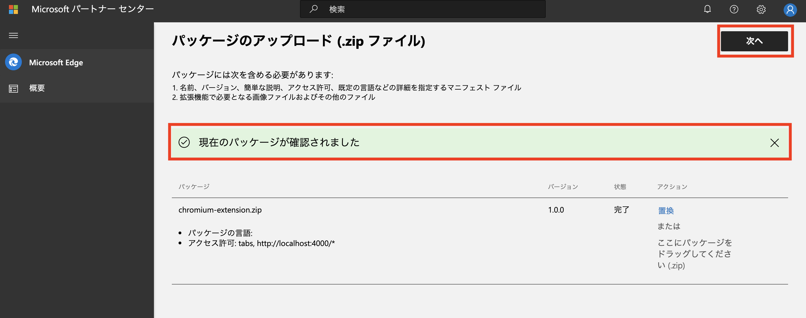
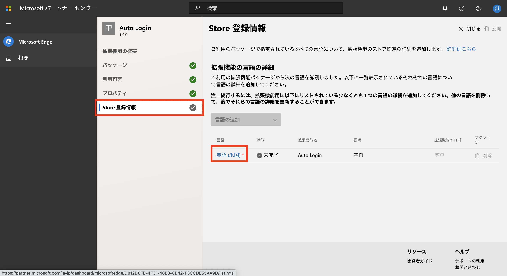

# Chrome,Edge,Firefox,Safari　配布方法

### Chrome拡張機能　ストア公開手順
1. manifestファイルを含めた拡張機能のファイルをzip化する
2. 開発アカウントを作成する
   1. [開発者コンソール](https://chrome.google.com/webstore/devconsole/register)にアクセスし、アカウントを登録する。
3. zipファイルをアップロードする
   1. [開発者コンソール](https://chrome.google.com/webstore/devconsole/register)に2で作成したアカウントでログインする
   2. 「新しくアイテムを追加する」をクリックする
   3. 「拡張機能またはアプリ(.zipファイル)をアップロード」の項目の中の「ファイルを選択」をクリックします
   4. 1で作成したzipファイルを選択する
   5. アップロードをクリック
4. アイコンを設定する
   1. ダッシュボードから128×128サイズのアイコン画像を用意し設定する
5. 公開設定オプションを設定する
   1. 「公開」にチェックし「変更を公開」をクリックする

### Edge拡張機能　ストア公開手順
1. Microsoft Edge 拡張機能開発者として登録する
   1. [Microsoft|アカウント](https://account.microsoft.com/account)に移動しアカウントを作成する
   
   
   2. [開発者ページ](https://partner.microsoft.com/dashboard/microsoftedge/public/login?ref=dd)に移動し、サインインし、登録フォームを入力する
   
   
   
2. 拡張機能を Microsoft Edge アドオンストアに提出する
   1. [Microsoft Partner Center](https://partner.microsoft.com/en-us/dashboard/microsoftedge/overview)から概要の`新しい拡張機能の作成`をクリック。
   
   1. `ファイルを参照`をクリックしchromium-extensionsフォルダをzip化したものをアップロードします。
   
   2. アップロードされたことを確認し、`次へ`をクリック。
   
   3. 利用可否を入力し、`下書きの保存`をクリックします。
   
   4. プロパティを入力し、`下書きの保存`をクリックします。
   
   5. store登録情報から、言語の`英語(米国)`をクリックします。
   
   6. 英語(米国)の詳細を入力し、`下書きの保存`をクリック、`閉じる`をクリックします。
   
   7. 以下の画像のようにチェックマークが全て緑になっていることを確認し、`公開`をクリックします。
   
   8. 認定の注意書きを入力し、`公開`をクリックします。
   

### Safari extensions Appstore公開手順
1. 開発アカウントを作成する
   1. [AppStoreConnect](https://appstoreconnect.apple.com/login)にアクセスし、アカウントを登録する
2. App作成
   1. AppStoreConnectから「Apps」の＋ボタンをクリックし「New Apps」をクリックする
   2. Xcodeからプロジェクトファイルを選択し、「TARGET」から「Bundle Identifier」を設定する(Appstoreと同じ値)
   3. Assets.xcassetsからアイコンを設定する
3. アップロード
   1. xcodeのメニューからArchiveをクリックし
   2. Distribute Appをクリック
   3. AppStoreConnectにチェックし「next」をクリック
   4. AppStoreConnectからBuildをクリックする
4. アプリの設定
   1. AppStoreConnectからアプリの情報を設定し公開する

### Firefox
1. アカウント作成
   1. [アドオン開発者センター](https://addons.mozilla.org/ja/developers/)にアクセスしアカウントを登録する
2. 拡張機能のファイルをzip化する
3. アドオンの登録
   1. アドオン開発者センターから「初めてのアドオンの登録」をクリック
   2. 配布手段を選択し、続けるをクリック
   3. 「ファイルを選択」をクリックし2で作成したzipファイルを選択
   4. 「アドオンの説明」画面に必要事項を記入・入力し（名前と概要は manifest.json に記載のものが転記されている）、「バージョンを登録」を押して登録する
   5. 完了し、「掲載ページを管理」をクリックして各種情報の変更や更新を行う
